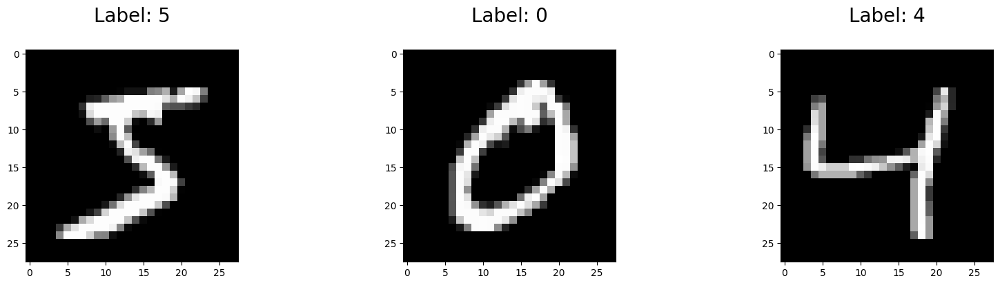
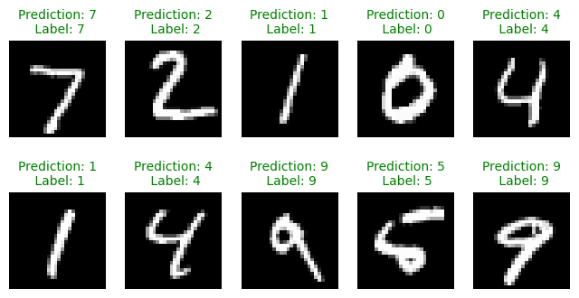

# Classification of handwritten digits using an MLP

In this exercise, you will train a multi-layer perceptron (MLP) to classify handwritten digits from the MNIST dataset. The MNIST dataset consists of 28x28 grayscale images of handwritten digits (0 to 9). The task is to classify each image into one of the 10 classes (one for each digit).

# Summary
This exercise focuses on classifying handwritten digits using a multi-layer perceptron (MLP) with the MNIST dataset. 

## Dataset Overview: 
The MNIST dataset consists of thousands of 28x28 grayscale images of handwritten digits (0-9).

## Loading Data: 
I begin by loading the dataset using scikit-learn, which provides the images (features) and their corresponding labels (digits).

## Data Preparation: 
The dataset is split into training and test sets. 
The images are converted into NumPy arrays and scaled from pixel values (0-255) to a range of 0-1 for better model performance.

## Model Creation: 
I create a multi-layer perceptron classifier using scikit-learn's neural network module. 
The model is configured with parameters such as the number of hidden layers and the number of training iterations (epochs).

## Training the Model: 
I train the model while monitoring the loss, which decreases over time, indicating improved performance.

## Model Evaluation: 
The accuracy of the model is evaluated on both the training and test datasets. 
As expected, the training accuracy is typically higher than the test accuracy since the model has not seen the test data during training.

## Predictions: 
Finally, I make predictions using the model on a set of images and compare the predicted labels with the original labels.


## Step 1: Load the dataset
We obtain the MNIST dataset using scikit-learn.

```
# Load MNIST using sklearn.datasets.fetch_openml

import matplotlib.pyplot as plt
import numpy as np
from sklearn.datasets import fetch_openml

# Load data from https://www.openml.org/d/554
X, y = fetch_openml("mnist_784", version=1, return_X_y=True, parser="auto")

# Split into train and test
X_train, X_test = X[:60000], X[60000:]
y_train, y_test = y[:60000], y[60000:]
print(f"Training set size: {len(X_train)}")
print(f"Test set size: {len(X_test)}")

# Convert to numpy arrays and scale for the model
X_train = np.array(X_train) / 255
X_test = np.array(X_test) / 255
y_train = np.array(y_train, dtype=np.int8)
y_test = np.array(y_test, dtype=np.int8)

# Show the first 3 images
plt.figure(figsize=(20, 4))
for index, (image, label) in enumerate(zip(X_train[0:3], y_train[0:3])):
    plt.subplot(1, 3, index + 1)
    plt.imshow(np.reshape(image, (28, 28)), cmap=plt.cm.gray)
    plt.title("Label: %s\n" % label, fontsize=20)
```
## Handwritten Digits Image



# Step 2: Create and train a Multi-Layer Perceptron
We will use ```sklearn.neural_network``` to build a Multi-Layer Perceptron in a single command. We'll train it using a second command!

```
# Train an MLP classifier using sklearn.neural_network.MLPClassifier

from sklearn.neural_network import MLPClassifier

# Create an MLPClassifier object
mlp = MLPClassifier(
    hidden_layer_sizes=(50,),
    max_iter=10,
    alpha=1e-4,
    solver="sgd",
    verbose=10,
    random_state=1,
    learning_rate_init=0.1,
)


# Train the MLPClassifier
mlp.fit(X_train, y_train)
```
## Step 3: Evaluate the model on a hold-out dataset
We will assess the performance of the model on data that was not used for training. 
In this case, we had separated out data into training and test splits, so we will show the accuracy for each.
```
# Show the accuracy on the training and test sets

print(f"Training set score: {mlp.score(X_train, y_train)}")
print(f"Test set score: {mlp.score(X_test, y_test)}")
```
Lastly, even though metrics are important to look it, it's always a good idea to look directly at your data to catch any problems or bugs you might have missed.

```
# Show the images, predictions, and original labels for 10 images

# Get the predictions for the test dataset
predictions = mlp.predict(X_test)

# Show the predictions in a grid
plt.figure(figsize=(8, 4))

for index, (image, prediction, label) in enumerate(
    zip(X_test[0:10], predictions[0:10], y_test[0:10])
):
    plt.subplot(2, 5, index + 1)
    plt.imshow(np.reshape(image, (28, 28)), cmap=plt.cm.gray)

    # Green if correct, red if incorrect
    fontcolor = "g" if prediction == label else "r"
    plt.title(
        "Prediction: %i\n Label: %i" % (prediction, label), fontsize=10, color=fontcolor
    )

    plt.axis("off")  # hide axes
```
## Predictions Image


